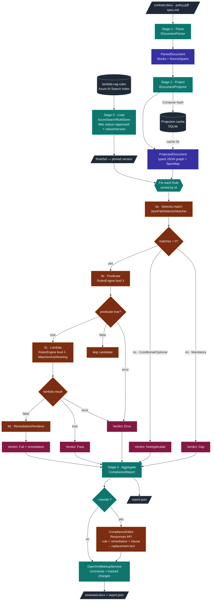

# Document → Section → Rule Pipeline

> How lambda-rag walks a document, slices it into sections, and runs rules
> against those sections to produce a deterministic compliance report.
>
> This is the **runtime** path (no LLM in the loop). For the offline
> *authoring* path that produces the rules in the first place, see
> [`docs/diagrams/authoring-vs-runtime.md`](diagrams/authoring-vs-runtime.md).

---

## TL;DR

For every contract we review:

1. **Parse** the raw bytes (PDF / DOCX / Markdown) into a `ParsedDocument`
   — a flat sequence of paragraphs and headings, each carrying a
   `SourceSpan` (byte/char offsets back to the original file).
2. **Project** the parsed document into a typed JSON graph
   (`ProjectedDocument`) — sections classified into a domain shape
   (`payment_terms`, `liability`, `confidentiality`, …).
3. For **each rule** in the `RuleSet` loaded from `lambda-rag-rules`
   (filtered to `status='approved'` AND the pinned
   `(rulesetName, rulesetVersion)`):
   1. **Select** the candidate sections from the graph using the rule's
      JSONPath-style `Selector`.
   2. Run the **predicate** (compiled Microsoft RulesEngine
      `bool LambdaExpression`) against each candidate — the
      *applicability gate*.
   3. Run the **lambda** against each surviving candidate — the
      pass/fail determination. Semantic rules call
      `SemanticFunctions.MatchesAnyMeaning(input, "<c1>|<c2>|…", threshold)`
      to compare a clause embedding against the rule's pinned
      concept embeddings.
   4. Render **remediation** if the lambda returned false.
4. Aggregate every rule's verdicts into a **`ComplianceReport`** and
   (optionally) materialise OpenXML comments + tracked changes back
   onto the source `.docx`. With `--rewrite`, each failed verdict
   first goes through the **compliance editor** (`LambdaRag.ComplianceEditor`),
   which calls Azure OpenAI Responses API to produce replacement
   clause text. The editor's output is rendered as a tracked
   insertion; the verdict itself is unchanged.

No LLM, no embeddings *in the decision path*. The lambda's
`MatchesAnyMeaning` call uses **pre-computed concept embeddings**
pinned to the ruleset version, so same source + same
`(rulesetName, rulesetVersion)` ⇒ byte-identical report. The
`--rewrite` flag is the **only** runtime non-determinism source,
and it only affects the redlined `.docx` — not the report or the
verdict.

---

## Stage 0 — Load ruleset

**Module:** [`LambdaRag.Indexing`](../src/LambdaRag.Indexing) ·
**Contract:** `IRuleStore` (in `LambdaRag.Core.Abstractions`).

Before the rule loop runs, the CLI resolves a `RuleSet` from the
`lambda-rag-rules` Azure AI Search index. The default implementation,
`AzureSearchRuleStore`, issues a single filtered query:

```
$filter = status eq 'approved'
      and rulesetName eq '<name>'
      and rulesetVersion eq '<version>'
```

The `(rulesetName, rulesetVersion)` pair comes from
`lambdarag.config.json` (or the `--ruleset-name` / `--ruleset-version`
CLI flags). The runtime never sees `draft`-status rules and never
floats between versions — both gates are query-time, not artifact-time.

> This is the boundary between authoring and runtime. See
> [`diagrams/authoring-vs-runtime.md`](diagrams/authoring-vs-runtime.md)
> for how the index is populated (blob → indexer → skillset →
> WebApiSkill → extract Function → index).

## Stage 1 — Parse

**Module:** [`LambdaRag.Parsing`](../src/LambdaRag.Parsing) ·
**Contract:** `IDocumentParser` (in `LambdaRag.Core.Abstractions`).

| Input format | Implementation       | Library                       |
| ------------ | -------------------- | ----------------------------- |
| `.pdf`       | `PdfParser`          | UglyToad.PdfPig               |
| `.docx`      | `DocxParser`         | DocumentFormat.OpenXml        |
| `.md`        | `MarkdownParser`     | Markdig                       |

Output: a `ParsedDocument` containing an ordered list of blocks
(headings, paragraphs, list items, tables) where every block carries
a `SourceSpan { DocumentId, CharStart, CharLength }`. The span is
the audit anchor used end-to-end so a verdict can always be traced
back to exact bytes in the original file.

The parser is **structurally faithful but semantically dumb** — it
does not classify sections; it only preserves order, hierarchy, and
offsets.

## Stage 2 — Project

**Module:** [`LambdaRag.Projection`](../src/LambdaRag.Projection) ·
**Contract:** `IDocumentProjector`.

The projector turns the flat `ParsedDocument` into a typed graph
(`ProjectedDocument.Graph`, a `JsonObject`) that reflects the *domain*,
not the document layout. The starter projector,
`DeterministicContractProjector`, is heading-driven and rule-based —
no LLM. It walks headings, classifies each section into a topic from
the ruleset's `TopicMap` (`payment_terms`, `termination`, `liability`,
`indemnity`, …), and emits a node per section:

```jsonc
{
  "sections": [
    {
      "id": "sec-0007",
      "category": "payment_terms",
      "heading": "4. Fees and Payment",
      "text": "Customer shall pay invoices within thirty (30) days …",
      "span": { "documentId": "…", "charStart": 4821, "charLength": 612 }
    },
    …
  ]
}
```

A `SpanMap` keyed by `id` lets every selector match be re-anchored
to its source span without re-parsing.

**Why a typed graph and not raw text?** Selectors and predicates are
written against a stable schema (`AppliesToSchema`), so a rule
authored against `payment_terms` keeps working even when the source
document numbers its sections differently or buries them inside an
appendix. The projector is the layer that absorbs document-shape
variation.

The projection is **cached** by
`ContentHash.Compose(sourceId, projectorId, projectorVersion, modelId, promptHash)`
so identical inputs never re-project.

## Stage 3 — Evaluate (per rule)

**Module:** [`LambdaRag.Evaluation`](../src/LambdaRag.Evaluation) ·
**Entry point:** `EvaluationService.EvaluateAsync(ruleSet, document)`.

Rules are processed in a stable order (sorted by `Rule.Id`). For each
rule:

### 3a. Select candidate sections

`ISelectorMatcher` (`JsonPathSelectorMatcher`) walks
`ProjectedDocument.Graph` with the rule's JSONPath-style `Selector`
and returns zero or more `MatchedSection { Path, Node, Span }`.
This is **pure code** — no fuzzy matching, no embeddings.

If `matches.Count == 0`:
- **Mandatory** rule ⇒ emit a `Gap` verdict ("document silently
  missed required content").
- **Conditional / Optional** rule ⇒ emit `NotApplicable`.

### 3b. Predicate (applicability gate)

For each candidate, the rule's `Predicate` (a Microsoft RulesEngine
`bool LambdaExpression`, default `"true"`) is compiled and run
against the candidate JSON converted to an `ExpandoObject`. If the
predicate returns `false`, the candidate is silently skipped. If it
throws, the verdict is `Error` and the exception is captured.

This gate is what lets a rule say *"applies only when
`category == 'payment_terms' && jurisdiction == 'EU'`"* without any
runtime LLM call.

### 3c. Lambda (pass/fail)

The rule's `Lambda` (also a RulesEngine `bool LambdaExpression`)
runs against the same `ExpandoObject` input.

| Return  | Outcome              |
| ------- | -------------------- |
| `true`  | `Pass`               |
| `false` | `Fail`               |
| throws  | `Error`              |

Each verdict carries a stable id derived from
`(rule_id, rule_version, ruleset_id, ruleset_version, predicate_hash,
span, outcome)` so re-running the same evaluation produces
byte-identical verdict ids.

### 3d. Remediation

When the lambda returns `false` and the rule defined a `Remediation`
template, `RemediationRenderer` expands the template using the rule
metadata and matched section. The rendered string is stored on the
verdict and is what the markup stage writes into Word as a tracked
insertion.

If a rule had matches but the predicate skipped all of them, the
service still emits one `Gap`/`NotApplicable` verdict so every rule
appears in the audit trail.

## Stage 4 — Aggregate, optional rewrite, and mark up

**Modules:**
[`LambdaRag.Authoring/Editing`](../src/LambdaRag.Authoring/Editing) (opt-in) ·
[`LambdaRag.Markup`](../src/LambdaRag.Markup) ·
**Services:** `ComplianceEditor` · `OpenXmlMarkupService`.

`EvaluationService` wraps every verdict for the run into a
`ComplianceReport` (with score = `passed / (passed + failed + gaps)`
— gaps count against the score because a missing mandatory clause
is still a finding).

For DOCX inputs, `OpenXmlMarkupService` then:

1. Reopens the original `.docx` (we never edit the original bytes
   in place — we clone the package).
2. Walks paragraphs, finds the run that contains each verdict's
   `SourceSpan`, and inserts:
   - a Word **comment** anchored at the span (the verdict text +
     evidence quote + rule remediation), and
   - a tracked **insertion** carrying the rendered remediation
     (when present), or a tracked **deletion** for redactions.
3. **If `--rewrite` was passed**, each failing verdict is first
   sent to the compliance editor *before* markup. The editor
   receives `(rule.naturalLanguage, rule.remediation, originalClauseText)`
   and returns proposed replacement text via Azure OpenAI Responses
   API. The markup stage then emits the original run as a tracked
   **deletion** and the editor's output as a tracked **insertion**.
   The verdict object itself is unchanged — the editor's output
   never influences pass/fail.
4. Writes a `reviewed.docx` that opens cleanly in Word's review pane.

> ⚠️ Tracked-change anchoring fidelity is a known Phase-2 hardening
> area — see issues
> [#53](https://github.com/MTCMarkFranco/lambda-rag/issues/53)–[#56](https://github.com/MTCMarkFranco/lambda-rag/issues/56).

---

## End-to-end flow (Mermaid)



---

## Determinism guarantees

| Property                                | Mechanism                                             |
| --------------------------------------- | ----------------------------------------------------- |
| Same source + ruleset version ⇒ same report | No LLM in the decision loop; `ExecuteAllRulesAsync` is pure; concept embeddings are pinned to the ruleset version |
| Stable rule set across runs             | `AzureSearchRuleStore` filters by `status='approved'` AND `rulesetVersion=<pinned>`; the index never silently swaps content |
| Stable verdict ordering                 | Sort rules by `Id`, then by `span.CharStart`          |
| Stable verdict ids                      | SHA-256 over `(rule, ruleset, predicate, span, outcome)` |
| Cached projection is byte-identical     | `ProjectedDocument.CacheKey` composes every input     |
| Predicate change ⇒ new verdict id       | `PredicateHash` is folded into the verdict id         |
| RuleSet change ⇒ new fingerprint        | `RuleSet.Fingerprint` composes every rule's `contentHash` |
| `--rewrite` does **not** affect determinism of the report | The editor runs *after* `ComplianceReport` is finalized; its output only changes `reviewed.docx`, never `report.json` |

---

## Where to read the code

| Stage                | File                                                                                |
| -------------------- | ----------------------------------------------------------------------------------- |
| Load ruleset         | `src/LambdaRag.Indexing/AzureSearch/AzureSearchRuleStore.cs`                        |
| Parse                | `src/LambdaRag.Parsing/{DocxParser,PdfParser,MarkdownParser}.cs`                    |
| Project              | `src/LambdaRag.Projection/Projectors/DeterministicContractProjector.cs`             |
| Select               | `src/LambdaRag.Selectors/JsonPathSelectorMatcher.cs`                                |
| Predicate + Lambda   | `src/LambdaRag.Evaluation/Engine/EvaluationService.cs`                              |
| Semantic match       | `src/LambdaRag.Core/Semantic/SemanticFunctions.cs`                                  |
| Workflow assembly    | `src/LambdaRag.Evaluation/Workflow/WorkflowFactory.cs`                              |
| Remediation          | `src/LambdaRag.Evaluation/Engine/RemediationRenderer.cs`                            |
| Rewrite (opt-in)     | `src/LambdaRag.Authoring/Editing/ComplianceEditor.cs`                               |
| Markup               | `src/LambdaRag.Markup/OpenXmlMarkupService.cs`                                      |

See also: [`ARCHITECTURE.md`](ARCHITECTURE.md),
[`DETERMINISM.md`](DETERMINISM.md),
[`SELECTORS.md`](SELECTORS.md).
