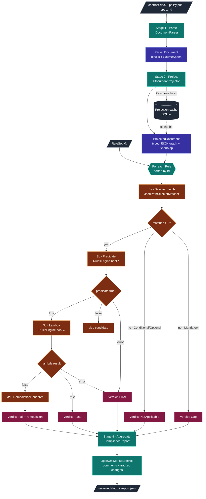

# Document → Section → Rule Pipeline

> How lambda-rag walks a document, slices it into sections, and runs rules
> against those sections to produce a deterministic compliance report.
>
> This is the **runtime** path (no LLM in the loop). For the offline
> *authoring* path that produces the rules in the first place, see
> [`docs/diagrams/authoring-vs-runtime.md`](diagrams/authoring-vs-runtime.md).

---

## TL;DR

For every contract we review:

1. **Parse** the raw bytes (PDF / DOCX / Markdown) into a `ParsedDocument`
   — a flat sequence of paragraphs and headings, each carrying a
   `SourceSpan` (byte/char offsets back to the original file).
2. **Project** the parsed document into a typed JSON graph
   (`ProjectedDocument`) — sections classified into a domain shape
   (`payment_terms`, `liability`, `confidentiality`, …).
3. For **each rule** in the published `RuleSet`:
   1. **Select** the candidate sections from the graph using the rule's
      JSONPath-style `Selector`.
   2. Run the **predicate** (compiled Microsoft RulesEngine
      `bool LambdaExpression`) against each candidate — the
      *applicability gate*.
   3. Run the **lambda** against each surviving candidate — the
      pass/fail determination.
   4. Render **remediation** if the lambda returned false.
4. Aggregate every rule's verdicts into a **`ComplianceReport`** and
   (optionally) materialise OpenXML comments + tracked changes back
   onto the source `.docx`.

No LLM, no embeddings, no nondeterminism on this path. Same source +
same `RuleSet` ⇒ byte-identical report.

> **Pillar 1 — doc-kind gating (#116).** Between Project and "for each
> rule" there is a deterministic *doc-kind* resolution: explicit CLI
> flag (`--doc-kind arb-psa`) → filename heuristic
> (`samples/architecture/**` → `arb-psa`) → heading-bigram classifier
> over a signed dictionary. Any rule whose `appliesToDocKinds` list is
> non-empty and does not contain the resolved kind is **skipped**,
> emitting a single `Skipped` verdict so the audit trail still cites
> the rule. When every rule got skipped, the report carries
> `wrong_profile: true` — the operator picked the wrong ruleset
> profile for this artifact.

---

## Stage 1 — Parse

**Module:** [`LambdaRag.Parsing`](../src/LambdaRag.Parsing) ·
**Contract:** `IDocumentParser` (in `LambdaRag.Core.Abstractions`).

| Input format | Implementation       | Library                       |
| ------------ | -------------------- | ----------------------------- |
| `.pdf`       | `PdfParser`          | UglyToad.PdfPig               |
| `.docx`      | `DocxParser`         | DocumentFormat.OpenXml        |
| `.md`        | `MarkdownParser`     | Markdig                       |

Output: a `ParsedDocument` containing an ordered list of blocks
(headings, paragraphs, list items, tables) where every block carries
a `SourceSpan { DocumentId, CharStart, CharLength }`. The span is
the audit anchor used end-to-end so a verdict can always be traced
back to exact bytes in the original file.

The parser is **structurally faithful but semantically dumb** — it
does not classify sections; it only preserves order, hierarchy, and
offsets.

## Stage 2 — Project

**Module:** [`LambdaRag.Projection`](../src/LambdaRag.Projection) ·
**Contract:** `IDocumentProjector`.

The projector turns the flat `ParsedDocument` into a typed graph
(`ProjectedDocument.Graph`, a `JsonObject`) that reflects the *domain*,
not the document layout. The starter projector,
`DeterministicContractProjector`, is heading-driven and rule-based —
no LLM. It walks headings, classifies each section into a topic from
the ruleset's `TopicMap` (`payment_terms`, `termination`, `liability`,
`indemnity`, …), and emits a node per section:

```jsonc
{
  "sections": [
    {
      "id": "sec-0007",
      "category": "payment_terms",
      "heading": "4. Fees and Payment",
      "text": "Customer shall pay invoices within thirty (30) days …",
      "span": { "documentId": "…", "charStart": 4821, "charLength": 612 }
    },
    …
  ]
}
```

A `SpanMap` keyed by `id` lets every selector match be re-anchored
to its source span without re-parsing.

**Why a typed graph and not raw text?** Selectors and predicates are
written against a stable schema (`AppliesToSchema`), so a rule
authored against `payment_terms` keeps working even when the source
document numbers its sections differently or buries them inside an
appendix. The projector is the layer that absorbs document-shape
variation.

The projection is **cached** by
`ContentHash.Compose(sourceId, projectorId, projectorVersion, modelId, promptHash)`
so identical inputs never re-project.

## Stage 3 — Evaluate (per rule)

**Module:** [`LambdaRag.Evaluation`](../src/LambdaRag.Evaluation) ·
**Entry point:** `EvaluationService.EvaluateAsync(ruleSet, document)`.

Rules are processed in a stable order (sorted by `Rule.Id`). For each
rule:

### 3a. Select candidate sections

`ISelectorMatcher` (`JsonPathSelectorMatcher`) walks
`ProjectedDocument.Graph` with the rule's JSONPath-style `Selector`
and returns zero or more `MatchedSection { Path, Node, Span }`.
This is **pure code** — no fuzzy matching, no embeddings.

If `matches.Count == 0`:
- **Mandatory** rule ⇒ emit a `Gap` verdict ("document silently
  missed required content").
- **Conditional / Optional** rule ⇒ emit `NotApplicable`.

### 3b. Predicate (applicability gate)

For each candidate, the rule's `Predicate` (a Microsoft RulesEngine
`bool LambdaExpression`, default `"true"`) is compiled and run
against the candidate JSON converted to an `ExpandoObject`. If the
predicate returns `false`, the candidate is silently skipped. If it
throws, the verdict is `Error` and the exception is captured.

This gate is what lets a rule say *"applies only when
`category == 'payment_terms' && jurisdiction == 'EU'`"* without any
runtime LLM call.

### 3c. Lambda (pass/fail)

The rule's `Lambda` (also a RulesEngine `bool LambdaExpression`)
runs against the same `ExpandoObject` input.

| Return  | Outcome              |
| ------- | -------------------- |
| `true`  | `Pass`               |
| `false` | `Fail`               |
| throws  | `Error`              |

Each verdict carries a stable id derived from
`(rule_id, rule_version, ruleset_id, ruleset_version, predicate_hash,
span, outcome)` so re-running the same evaluation produces
byte-identical verdict ids.

#### 3c.1 Semantic binding (Pillar 6, #124)

Before invoking the lambda, if the rule declares
`semanticAnchors[]` and the engine was constructed with an
`ITokenEmbedder`, the evaluator:

1. Tokenizes the matched section's body text via the signed
   `SemanticTokenizer` (unigrams + bigrams by default; trigrams opt-in).
2. Embeds each anchor + each token through the file-backed embedding
   cache (offline after first warm-up).
3. Cosine-compares every anchor vector against every token vector and
   collects `(text, span, cosine)` tuples whose cosine ≥
   `anchor.threshold`.
4. Pushes the bindings into an AsyncLocal scope so the lambda can call
   `LambdaPrimitives.SemanticBindings("anchor_name")` and receive a
   typed list of `TokenMatch`.
5. Records the top-3 bindings per anchor on `Verdict.SemanticBindings`
   so the audit trail proves the verdict is reproducible from the
   `(rule, projection, embedder)` bytes alone.

Rules without `semanticAnchors[]` skip the binding pass entirely, so
adding Pillar 6 to a fresh ruleset cannot regress legacy verdicts —
the additive guarantee is asserted by `AdditiveGuaranteeTests` in
`tests/LambdaRag.IdempotencyTests/`.

### 3d. Remediation

When the lambda returns `false` and the rule defined a `Remediation`
template, `RemediationRenderer` expands the template using the rule
metadata and matched section. The rendered string is stored on the
verdict and is what the markup stage writes into Word as a tracked
insertion.

If a rule had matches but the predicate skipped all of them, the
service still emits one `Gap`/`NotApplicable` verdict so every rule
appears in the audit trail.

## Stage 4 — Aggregate & mark up

**Module:** [`LambdaRag.Markup`](../src/LambdaRag.Markup) ·
**Service:** `OpenXmlMarkupService` ·
**Optional rewriter:** `IClauseRewriter` (fed by
[`ComplianceEditor`](../src/LambdaRag.Authoring/Editing/ComplianceEditor.cs)
in `LambdaRag.Authoring`).

`EvaluationService` wraps every verdict for the run into a
`ComplianceReport` (with score = `passed / (passed + failed + gaps)`
— gaps count against the score because a missing mandatory clause
is still a finding).

For DOCX inputs, `OpenXmlMarkupService` then:

1. Reopens the original `.docx` (we never edit the original bytes
   in place — we clone the package).
2. Walks paragraphs, finds the run that contains each verdict's
   `SourceSpan`, and inserts:
   - a Word **comment** anchored at the span (the verdict text +
     evidence quote), and
   - a tracked **insertion** carrying the rendered remediation
     (when present), or a tracked **deletion** for redactions.
3. When `--rewrite` is passed, `ComplianceEditor` renders a concrete
   replacement clause for each `Fail` verdict (deterministic, no
   runtime LLM — keyed off the rule, the failing input, and the
   ruleset fingerprint) and the markup stage emits it as a paired
   `w:del` of the offending clause + `w:ins` of the rewrite, both
   anchored at the verdict's `SourceSpan`. The plain comment-only
   path remains the default; `--rewrite` is opt-in.
4. Writes a `reviewed.docx` that opens cleanly in Word's review pane.

> ⚠️ Tracked-change anchoring fidelity is a known Phase-2 hardening
> area — see issues
> [#53](https://github.com/MTCMarkFranco/lambda-rag/issues/53)–[#56](https://github.com/MTCMarkFranco/lambda-rag/issues/56).

---

## End-to-end flow (Mermaid)



---

## Determinism guarantees

| Property                                | Mechanism                                             |
| --------------------------------------- | ----------------------------------------------------- |
| Same source + ruleset ⇒ same report     | No LLM at runtime; `ExecuteAllRulesAsync` is pure     |
| Stable verdict ordering                 | Sort rules by `Id`, then by `span.CharStart`          |
| Stable verdict ids                      | SHA-256 over `(rule, ruleset, predicate, span, outcome)` |
| Cached projection is byte-identical     | `ProjectedDocument.CacheKey` composes every input     |
| Predicate change ⇒ new verdict id       | `PredicateHash` is folded into the verdict id         |
| RuleSet change ⇒ new fingerprint        | `RuleSet.Fingerprint` composes every rule fingerprint |

---

## Where to read the code

| Stage                | File                                                                                |
| -------------------- | ----------------------------------------------------------------------------------- |
| Parse                | `src/LambdaRag.Parsing/{DocxParser,PdfParser,MarkdownParser}.cs`                    |
| Project              | `src/LambdaRag.Projection/Projectors/DeterministicContractProjector.cs`             |
| Select               | `src/LambdaRag.Selectors/JsonPathSelectorMatcher.cs`                                |
| Predicate + Lambda   | `src/LambdaRag.Evaluation/Engine/EvaluationService.cs`                              |
| Workflow assembly    | `src/LambdaRag.Evaluation/Workflow/WorkflowFactory.cs`                              |
| Remediation          | `src/LambdaRag.Evaluation/Engine/RemediationRenderer.cs`                            |
| Markup               | `src/LambdaRag.Markup/OpenXmlMarkupService.cs`                                      |
| Rewrite (--rewrite)  | `src/LambdaRag.Authoring/Editing/ComplianceEditor.cs` + `src/LambdaRag.Markup/IClauseRewriter.cs` |

See also: [`ARCHITECTURE.md`](ARCHITECTURE.md),
[`DETERMINISM.md`](DETERMINISM.md),
[`SELECTORS.md`](SELECTORS.md).
