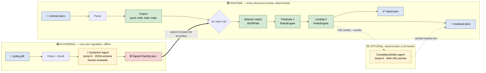
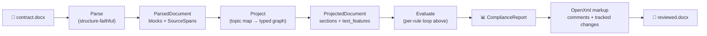

# Lambda-RAG: Determinism Where It Matters, LLMs Where They Help

*A pattern for AI-assisted document review that can withstand a legal
audit — because the part the lawyers care about never runs a model.*

---

> 🖼️ **Note on illustrations.** This post is checked into the
> [`lambda-rag`](https://github.com/MTCMarkFranco/lambda-rag) repo as
> source-of-truth markdown. The diagrams below are Mermaid because they
> live next to the code and have to stay in sync with it. When this is
> cross-posted to Medium, drop in stylized cartoon renders generated
> from these same shapes — flat, no text, two colors (slate +
> teal/amber); the captions carry all the words.

---

## The problem with letting an LLM run your compliance review

Pick any of the obvious ideas:

> "Give GPT-4 the contract and our policy. Ask: does this contract
> comply? Have it write a redlined Word doc."

It will work. It will look magical in the demo. Then the customer's
lawyer will ask one of three questions and the whole thing falls apart:

1. **"Run it again."** You'll get a different answer. Sometimes
   slightly. Sometimes meaningfully. The model is non-deterministic by
   design.
2. **"Why this verdict?"** The chain-of-thought you show is not the
   chain-of-thought the model used. You can't introspect it. You can't
   defend it.
3. **"Show me the policy clause that says this."** You can ask the
   model to cite, but the citation isn't load-bearing — it's part of
   the same probabilistic output.

For contract review, regulatory compliance, audit, or permitting,
those three questions are the *point*. You don't get to wave them away
with "it's an AI tool."

You could put a 100% LLM solution into production. It just wouldn't
withstand legal scrutiny — and the moment a verdict is contested, you
have nothing to point at.

[**lambda-rag**](https://github.com/MTCMarkFranco/lambda-rag) is a
different shape. It's an open-source .NET platform that does what the
naive prompt does — turn a policy into rules, project them over a
contract, emit a verdict report and a redlined Word doc — but with a
guarantee:

> **Same source bytes + same ruleset = byte-identical report.json and
> byte-identical OOXML parts in reviewed.docx, every time, forever.**

That guarantee survives because no LLM is in the decision loop.

---

## Where the LLM does and does *not* fit



| Phase | LLM allowed? | Why |
|------|--------------|-----|
| **Authoring** (offline, once) | ✅ Yes — temp=0, JSON-schema-validated, human-reviewed | A human gate is feasible; output is signed and pinned. |
| **Projection** (per document) | ⚠️ Pure-code first; AI fallback cached | Same bytes → same projection. |
| **Selection** (per rule × section) | ❌ Never | Pure JSONPath / regex over a typed graph. |
| **Evaluation** (verdict) | ❌ Never | Compiled lambdas. The verdict is a pure function. |
| **Markup** (write redlines into Word) | ❌ Never | OpenXml tracked changes with a fixed timestamp. |
| **Rewrite** (proposed replacement text) | ⚠️ Yes, *opt-in* — SHA-256 cached, deterministic prompt | Doesn't change the verdict; cache makes re-runs idempotent. |

Two LLM appearances. Both gated. Both auditable. **Neither in the
verdict path.**

---

## The pattern, in one line

> Authoring is where we let the LLM extract structure. Runtime is where
> we run that structure as code. The signed ruleset is the only thing
> that crosses the boundary.

That is the whole bet. Everything below is engineering to make it
true.

---

## Engineering walkthrough

### 1. Ingest a policy, produce rules

You hand `lambda-rag` a directory of PDFs / Word docs. An extraction
agent — Microsoft Agent Framework, OpenAI Responses API, **temperature
zero, locked prompts, JSON-schema-validated output, human review
gate** — emits a `RuleSet.json` like this:

```json
{
  "id": "CTSO-CONF-001",
  "version": "1.1.0",
  "naturalLanguage": "Confidentiality clause must define a survival period (years) for the NDA obligations.",
  "predicate": "input1.category == \"confidentiality\"",
  "lambda":    "input1.text.Contains(\"perpetual\") || input1.text_features.year_counts.Count > 0",
  "appliesToSchema": { "type": "object" },
  "selector": { "kind": "path", "path": "$.sections[*]" },
  "severity": "Violation",
  "sourceSpan": { "documentId": "contoso-policy", "charStart": 0, "charLength": 1, "headingPath": null },
  "evidenceQuote": "Confidentiality survival",
  "remediation": "Add an explicit survival period (e.g., \"obligations survive for five (5) years from termination\")."
}
```

Things to notice:

- The rule is **not natural language**. It compiles. Two fields —
  `predicate` and `lambda` — are
  [Microsoft RulesEngine](https://github.com/microsoft/RulesEngine)
  boolean lambda expressions. They're code.
- The `selector` is a JSONPath-style query against a **projected
  document graph** (more on that in step 3). Not against raw text.
- Every rule carries its `sourceSpan` and `evidenceQuote` — the
  citation back to the originating policy clause. The chain of
  custody is the rule itself.
- A signed `ruleSetFingerprint` (SHA-256 of the canonical JSON of all
  rules) is what tags every downstream verdict. A drift in any rule
  changes the fingerprint and is visible in every report that
  references it.

> The natural-language statement (`naturalLanguage`) is there for
> humans reviewing the ruleset and for the comment text that lands in
> Word. The runtime doesn't read it.

### 2. Lambda construction — what `predicate` and `lambda` actually do

The runtime has two compiled lambdas per rule, both built from the
strings in the ruleset:

```
Selector finds candidate sections           → 0..N MatchedSection
   ↓
Predicate (the applicability gate)          → bool
   ↓ (true)
Lambda (the pass/fail determination)        → bool
   ↓ (false)
RemediationRenderer                          → "fix it like this"
```

The predicate is the *applicability gate*. It is what lets a rule say
"applies only when `category == 'payment_terms' && jurisdiction ==
'EU'`" with no runtime LLM call. Think of it as `WHERE` in SQL.

The lambda is the verdict. Same engine, same input shape, but the
return value is now what gets stamped onto the report:

| Lambda returns | Outcome              |
| -------------- | -------------------- |
| `true`         | `Pass`               |
| `false`        | `Fail` (+ remediation rendered) |
| throws         | `Error`              |
| no matches     | `Gap` (Mandatory) / `NotApplicable` (Optional/Conditional) |

Both lambdas are compiled into a one-rule `Workflow` and executed
against a dynamic `ExpandoObject` projection of the matched section —
which is why the ruleset can address fields like
`input1.text_features.dollar_max` directly without any per-domain
code.

The core of the evaluator looks exactly as boring as it should:

```csharp
foreach (var rule in ruleSet.Rules.OrderBy(r => r.Id, StringComparer.Ordinal))
{
    var candidates = _matcher.Match(rule.Selector, document);

    foreach (var candidate in candidates)
    {
        var input = ToExpando(candidate.Node);

        if (!await Predicate(rule, input)) continue;        // gate
        var pass = await Lambda(rule, input);                // verdict

        verdicts.Add(pass
            ? Verdict.Pass(rule, candidate)
            : Verdict.Fail(rule, candidate, Remediation.Render(rule, candidate)));
    }

    if (verdicts.None(v => v.RuleId == rule.Id))
        verdicts.Add(rule.Applicability == Mandatory
            ? Verdict.Gap(rule)
            : Verdict.NotApplicable(rule));
}
```

Boring is the feature. Re-run it on the same inputs, get the same
list, in the same order, with the same ids.

### 3. Processing a document against the rules

Now the document side. A `.docx` (or `.pdf`, or `.md`) goes through
four stages:



**Parse** is structurally faithful but semantically dumb — it
preserves order, hierarchy, and character offsets. Every block carries
a `SourceSpan { documentId, charStart, charLength, headingPath }`.
That span is the audit anchor for the rest of the pipeline — a verdict
can always be traced back to exact bytes in the original file.

**Project** turns the flat parsed blocks into a typed graph that
reflects the *domain*, not the document layout:

```jsonc
{
  "sections": [
    {
      "id": "sec-0007",
      "category": "payment_terms",
      "heading": "4. Fees and Payment",
      "text": "Customer shall pay invoices within thirty (30) days …",
      "text_features": {
        "day_counts": [30],         "day_count_max": 30,
        "percent_values": [1.5],    "percent_max": 1.5,
        "dollar_amounts": []
      },
      "span": { "documentId": "…", "charStart": 4821, "charLength": 612 }
    }
  ]
}
```

The graph is what selectors and predicates address. It's why a rule
about "payment_terms" keeps working even when the document numbers its
sections differently. **The projector is the layer that absorbs
document-shape variation.**

The projection is also cached by a `ContentHash` that composes every
input. Identical inputs never re-project. (And in the case of an AI
fallback projector, identical inputs never re-call the model.)

**Evaluate** runs the per-rule loop from §2.

**Markup** opens the original `.docx`, walks paragraphs, and at each
verdict's `SourceSpan` inserts:

- a Word comment containing the rule's natural-language statement,
  severity, remediation, and the citation back to the policy, and
- with `--rewrite`, a tracked `<w:del>` of the offending clause paired
  with a `<w:ins>` of the proposed replacement.

The `reviewed.docx` opens cleanly in Word's review pane. The
timestamps on every tracked change are pinned to a fixed value so two
runs produce byte-identical OOXML parts.

### 4. The exciting bit — letting an LLM write the replacement clause, *idempotently*

The verdict is decided. The pure-code path has produced a
remediation template ("add an explicit survival period of N years").
That template is fine for a comment but not great as a tracked-change
replacement — you want real prose in the contract's voice, not a
how-to-fix note.

This is where `--rewrite` brings the LLM back in — under strict
conditions.

`ComplianceEditor` is a Microsoft Agent Framework v2 Prompt agent on
the Responses API. The agent does exactly one thing: take
`(rule, original clause text)` and return rewritten clause text. No
commentary, no JSON, no markdown. The prompt is locked:

```text
You are ComplianceEditor, a focused compliance redlining agent.
Your only job is to re-author a single contract clause so it complies
with a stated rule.

…

Output ONLY the rewritten clause text. No preamble, no markdown,
no quotes, no JSON, no "Here is...". Preserve the original tone and
structure of the clause; change only what is needed to make the
clause comply.
```

Calling it is wrapped in a SHA-256 cache:

```csharp
public async Task<string?> RewriteAsync(Verdict v, string clauseText, Rule? rule, CancellationToken ct)
{
    var key = ComputeCacheKey(rule, v, clauseText);   // SHA-256 of (ruleId, ruleSetVersion, predicate, lambda, clauseText)
    var cachePath = Path.Combine(_options.CacheDir, key + ".json");
    if (File.Exists(cachePath))
        return TryReadCache(cachePath);               // ← second run never calls the model

    var response = await _agent.RunAsync(BuildUserMessage(rule, v, clauseText), ct);
    var rewrite = Normalize(response?.Text);
    WriteCache(cachePath, rewrite);                   // ← first run writes the cache
    return rewrite;
}
```

Three properties fall out for free:

1. **Idempotent across runs.** Once a rewrite has been generated for a
   `(rule, clause)` pair, every subsequent run is a disk read. The
   model literally never sees that input again.
2. **Idempotent across machines.** The cache is keyed by content hash,
   not by user or session. Check the cache directory into the build
   artifacts and your CI run is byte-identical to a developer's
   laptop.
3. **Detached from the verdict.** A rewrite failure (timeout, network,
   safety filter) demotes the annotation to a plain comment. The
   `report.json` is unaffected. The legal record doesn't depend on the
   model being reachable.

A small additional rule landed in `main` this week: rewrites are
suppressed for spans that sit outside any heading (document title,
pre-amble). The model could write a beautiful replacement for the
title of an architecture document — and you almost certainly don't
want a tracked-change deletion of the title. The summary comment still
fires; the strike-through doesn't.

---

## Case study — ARB-PSA review (the accuracy uplift)

A field test caught lambda-rag in the act of *correctly* executing the
*wrong* rules. A customer's contract-style ruleset (confidentiality
survival, payment terms) was applied to a *Project Solution Architecture*
document. Lambda-rag deterministically scored 14.3% (1 of 7 adjudicated
verdicts), while an LLM reasoning baseline over the same artifact scored
58.3% (7 of 12 dimensions). The verdict was correct given the inputs.
The *inputs* were the bug.

The fix shipped on `branch-lambda-accuracy-1` is five surgical changes,
none of which adds an LLM to the runtime:

1. **Doc-kind gating (#116).** A signed dictionary (filename heuristic
   + heading-bigram classifier) resolves `doc_kind` *before*
   evaluation. Rules carry an `appliesToDocKinds` list; mismatches
   emit a `Skipped` verdict — audited, never silent. When every rule
   was skipped, the report carries `wrong_profile: true`.
2. **ARB-PSA topic map (#117).** A new `arb-psa.v1` topic map covers
   the 12 PSA review dimensions (PSA completeness, architecture
   constraints, risks, decision records, technology standards, design
   patterns, data security, integrations, infrastructure, security
   architecture, information governance, DR & resiliency).
3. **Semantic primitives (#118).** `LambdaPrimitives.RegexMatch`,
   `PhraseMatch` (over signed phrasebooks declared in the ruleset
   header), and a pinned `EmbedderId` startup check. `Contains("year")`
   matching `"yearly basis"` stops being a thing.
4. **ARB-PSA ruleset (#119).** ~15 hand-authored rules gated to
   `doc-kind=arb-psa`, covering all 12 dimensions with
   section-presence + quality-floor + standards-alignment checks.
5. **Template-boilerplate detector (#120).** `IsTemplateBoilerplate`
   — verbatim placeholder hit OR ≥ 30% boilerplate-character density.
   A section that exists but is still `"To be completed…"` now FAILs,
   matching the LLM's strongest discriminator.

The acceptance gates
(`prompt-contracts/accuracy-improvement-plan.md` §4) are:

- ≥ 7/7 recall on the LLM PASS set (the rules engine agrees with the
  LLM where the LLM said the artifact is fine).
- 0 false positives on the LLM FAIL set (the rules engine never PASSes
  a dimension the LLM said is broken).
- Byte-identical `report.json` across 100 consecutive runs.

The benchmark — `tests/LambdaRag.IdempotencyTests/ArbPsaBenchmark.cs` —
runs these as separate `[Fact]` methods so a regression shows up
exactly where it lives.

> 📊 **Before / after.** Empirical numbers from a local benchmark
> against the bundled PSA sample (customer-sensitive, gitignored) will
> be filled in here once the benchmark has run end-to-end. The
> acceptance gates above are what's enforced in CI.

---

## Determinism — what's actually guaranteed

| Property                                | Mechanism                                                |
| --------------------------------------- | -------------------------------------------------------- |
| Same source + ruleset ⇒ same report     | No LLM at runtime; `ExecuteAllRulesAsync` is pure        |
| Stable verdict ordering                 | Sort rules by `Id`, then by `span.CharStart`             |
| Stable verdict ids                      | SHA-256 over `(rule, ruleset, predicate, span, outcome)` |
| Cached projection is byte-identical     | `ProjectedDocument.CacheKey` composes every input        |
| Predicate change ⇒ new verdict id       | `PredicateHash` is folded into the verdict id            |
| RuleSet change ⇒ new fingerprint        | `RuleSet.Fingerprint` composes every rule fingerprint    |
| Rewrite is idempotent                   | SHA-256 cache keyed by (rule, clause)                    |

A 300+ test suite — 266 unit tests plus 35 idempotency / golden-master
proofs — fails the build if any of those properties drift. The
golden-master test in particular runs every regression document twice
and asserts the inner OOXML parts of `reviewed.docx` are byte-equal,
and that `report.json` is byte-equal. That test alone is the
load-bearing proof for the determinism claim.

---

## The honest counter-argument

Could you do all of this with a 100% LLM solution? Yes. With
function-calling and structured output and a clever prompt, you can
get something that *looks* exactly like a lambda-rag report.

You will give up four things:

- **Determinism.** Re-run it on the same contract tomorrow and the
  same model and the same prompt — different verdicts. Not always.
  Just often enough to lose the audit.
- **Idempotency.** No cache key is honest because the model could
  reasonably return any of several outputs for the same input.
- **Auditability.** The "reasoning" the model surfaces is not how the
  model decided. It's a separately-generated rationalization.
- **Defensibility under cross-examination.** When the question is
  "show me the line of code that produced this verdict", you point at
  a compiled boolean expression in a versioned ruleset. With a
  100% LLM solution you point at "the model said so."

For a marketing assistant or a code-review bot those four are
acceptable. For a contract review that goes in front of a regulator,
or a compliance check that decides whether a permit is issued, they
are not.

Lambda-RAG is the bet that you can use modern LLMs for the part that
genuinely needs natural-language understanding (turning policy text
into structured rules; rewriting a clause into compliant prose) and
keep the part that needs to survive a courtroom in plain compiled
code.

---

## Try it

```pwsh
git clone https://github.com/MTCMarkFranco/lambda-rag
cd lambda-rag
dotnet build
dotnet test    # 266 unit + 35 idempotency / golden-master proofs

# Sample contract → tracked-change redline with positive-confirmation comments
dotnet run --project src/LambdaRag.Cli -- review `
  --document samples/contracts/contoso-sample-contract.docx `
  --ruleset  rulesets/contracts/contoso-demo-ruleset.json `
  --out      out/sample `
  --mode     both `
  --rewrite `
  --annotate-pass
```

Outputs land in `out/sample/`:

- `report.json` — verdict, score, per-rule outcome, remediation, full
  provenance (rule ids, ruleset fingerprint, source spans).
- `reviewed.docx` — original document with tracked changes + comments
  + a gap-analysis summary at the top. Bytes are reproducible.

Two further reads if you're evaluating the pattern:

- [`docs/manifesto.md`](../manifesto.md) — the pattern in one page of
  prose. Read this before deciding whether lambda-rag fits your
  problem.
- [`docs/what-lambda-rag-is-not.md`](../what-lambda-rag-is-not.md) —
  the explicit non-claims sheet. The most useful single page for
  anyone deciding whether this tool fits a regulator-facing use case.

The repo is MIT-licensed. Issues and PRs welcome.

---

*Lambda-RAG is built and maintained at
[MTCMarkFranco/lambda-rag](https://github.com/MTCMarkFranco/lambda-rag).*
