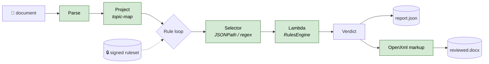

# Lambda-RAG — Canonical Architecture Diagram

> **One picture, two timelines.** Authoring is offline, AI-assisted, and
> human-reviewed. Runtime is online, deterministic, and fully auditable.
> The signed `RuleSet` is the only artifact that crosses the boundary.

This is the canonical diagram for the lambda-rag pattern. Issue
[#16](https://github.com/MTCMarkFranco/lambda-rag/issues/16) (P1.6).
Use it in slides, papers, and onboarding. Mermaid below renders directly
in GitHub, VS Code, and most static-site tools.

---

## The whole picture

```mermaid
flowchart LR
    subgraph AUTH["🟦 AUTHORING — offline, once per regulation"]
        direction TB
        A1["📄 policy.pdf<br/>regulation.html<br/>standard.docx"]
        A2["LambdaRag.Parsing<br/><i>parse + chunk</i>"]
        A3["LambdaRag.Authoring<br/><b>Extraction Agent</b><br/><i>MAF · temp=0 · JSON-schema</i>"]
        A4["Normalizer<br/><i>validate · dedup · pin</i>"]
        A5["👤 Human SME review<br/><i>accept / edit / reject</i>"]
        A6[("🔒 RuleStore<br/><b>signed ruleset.json</b><br/><i>fingerprint + version</i>")]
        A1 --> A2 --> A3 --> A4 --> A5 --> A6
    end

    subgraph RUN["🟩 RUNTIME — online, deterministic, no LLM in decision loop"]
        direction TB
        R1["📄 contract.docx<br/>arch-design.md<br/>permit-app.pdf"]
        R2["LambdaRag.Parsing<br/><i>same parser as authoring</i>"]
        R3["LambdaRag.Projection<br/><b>ProjectedDocument</b><br/><i>topic-map · cached · pure code (AI fallback)</i>"]
        R4{{"for each Rule"}}
        R5["LambdaRag.Selectors<br/><b>Selector.match</b><br/><i>JSONPath / regex / topic / heading</i>"]
        R6["LambdaRag.Evaluation<br/><b>Microsoft RulesEngine</b><br/><i>lambda over typed input</i>"]
        R7["LambdaRag.Core<br/><b>ComplianceReport</b><br/><i>per-rule verdict + evidence</i>"]
        R8["LambdaRag.Markup<br/><b>OpenXml tracked changes</b><br/><i>fixed timestamp · pinned IDs</i>"]
        R9[("📊 report.json")]
        R10[("📝 reviewed.docx<br/><i>byte-deterministic</i>")]
        R1 --> R2 --> R3 --> R4
        R4 --> R5 --> R6 --> R7
        R7 --> R8
        R7 --> R9
        R8 --> R10
    end

    A6 ==>|"signed ruleset<br/>crosses the boundary"| R4

    classDef llm fill:#fff4d6,stroke:#b8860b,color:#000
    classDef pure fill:#d4ead4,stroke:#2d6a2d,color:#000
    classDef artifact fill:#dde6f5,stroke:#1f4e89,color:#000
    classDef store fill:#f5d6d6,stroke:#993333,color:#000
    class A3 llm
    class R3,R5,R6,R8 pure
    class A1,R1,R9,R10 artifact
    class A6 store
```



**Legend**

| Color | Meaning |
|---|---|
| 🟨 Yellow | LLM permitted (authoring only, temp=0, JSON-schema-validated, human-reviewed) |
| 🟩 Green | Pure code — deterministic, no LLM in the decision path |
| 🟦 Blue | Document artifact (input or output) |
| 🟥 Red | Signed, fingerprinted, version-locked store |

---

## The boundary — what crosses

The **only** thing the runtime depends on from the authoring pipeline is
the signed `ruleset.json`. That isolation is what makes the runtime
defensible:

| Property | How it is enforced |
|---|---|
| **Auditable** | Every verdict cites a `ruleId`, `ruleSetFingerprint`, and `sourceSpan` (charStart, charLength, page, headingPath). |
| **Reproducible** | Same input bytes + same ruleset → byte-identical `report.json` and byte-identical inner OOXML parts of `reviewed.docx`. Locked by `ReviewedDocxIdempotency` golden-master test. |
| **Version-locked** | `ruleSetFingerprint` is a SHA-256 of canonical-JSON of the rule set. A drift in any rule changes the fingerprint and is visible in every downstream report. |
| **Free of runtime LLM** | `LambdaRag.Selectors` and `LambdaRag.Evaluation` reference no LLM clients. |

---

## Just the runtime (slides / papers — simplified)

When you only need to make the deterministic-runtime point, this
shorter Mermaid is the canonical reduced form:



---

## Module map

The diagram boxes correspond to these projects in `src/`:

| Phase | Project | Responsibility |
|---|---|---|
| Authoring | `LambdaRag.Parsing` | Parse + chunk regulations |
| Authoring | `LambdaRag.Authoring` | MAF extraction agent, normalization, coverage |
| Authoring | `LambdaRag.Indexing` | Optional Azure AI Search indexing of rule semantics — **authoring-side only** (see [`../../wrong-path-search-index.md`](../../wrong-path-search-index.md)) |
| Authoring | `LambdaRag.Authoring.ExtractFunction` | Azure Function exposing the extraction agent as a Web API custom skill |
| Authoring + Runtime | `LambdaRag.Persistence` | Signed `RuleStore` + load/save |
| Runtime | `LambdaRag.Parsing` | Parse the candidate document |
| Runtime | `LambdaRag.Projection` | Topic-map projection, pure-code first, optional AI fallback (cached) |
| Runtime | `LambdaRag.Selectors` | Pure-code matchers — JSONPath, regex, topic, heading |
| Runtime | `LambdaRag.Evaluation` | Microsoft RulesEngine lambda evaluation |
| Runtime | `LambdaRag.Core` | Domain types — `ComplianceReport`, `Verdict`, `Rule`, `RuleSet` |
| Runtime | `LambdaRag.Markup` | OpenXml tracked changes / comments emission |
| Runtime | `LambdaRag.Cli` | CLI entry point |
| Runtime | `LambdaRag.Api` | (future) REST surface |

---

## Anti-patterns this diagram excludes (deliberately)

The diagram is also a *contract* about what the pattern is **not**.
The following arrows are **invalid** and should never appear in a
lambda-rag implementation:

- ❌ Authoring artifact (RuleStore) → reads back into the LLM during runtime
- ❌ Runtime evaluation → calls an LLM to "decide" verdict
- ❌ Runtime markup → calls an LLM to "phrase" comments based on the document under review
- ❌ Runtime selector → uses an LLM to "find" relevant sections
- ❌ AI projection fallback → re-runs on cache hit (must be deterministic on cache hit)
- ❌ Runtime evaluation → fetches rules from an Azure AI Search index
  (see [`../../wrong-path-search-index.md`](../../wrong-path-search-index.md) — this is the
  exact direction `main` was reverted from at commit `93d7ca7`; rules
  are loaded from the signed on-disk `RuleSet.json` only)

If you're holding lambda-rag against another approach, those six
arrows are the diff.

---

## Rendering to PNG / SVG

The Mermaid above is the source of truth. PNG/SVG renders for slides
and print can be generated via the Mermaid CLI:

```bash
npx -y @mermaid-js/mermaid-cli -i docs/diagrams/authoring-vs-runtime.md -o docs/diagrams/authoring-vs-runtime.png
```

> **Source of truth is the Mermaid above** — do not hand-edit any
> generated PNG/SVG.

---

## Related docs

- [`ARCHITECTURE.md`](../ARCHITECTURE.md) — module-level details
- [`DETERMINISM.md`](../DETERMINISM.md) — byte-determinism mechanics
- [`SELECTORS.md`](../SELECTORS.md) — selector semantics
- [`what-lambda-rag-is-not.md`](../what-lambda-rag-is-not.md) — explicit non-claims
