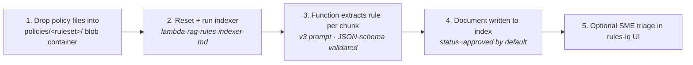
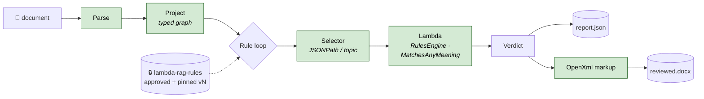

# Lambda-RAG — Canonical Architecture Diagram

> **One picture, two timelines.** Authoring is offline, AI-assisted,
> and human-gated. Runtime is online, deterministic, and fully
> auditable. The boundary between them is the
> **`lambda-rag-rules` Azure AI Search index**, filtered to approved
> rules of a pinned `(rulesetName, rulesetVersion)`.

This is the canonical diagram for the lambda-rag pattern. Issue
[#16](https://github.com/MTCMarkFranco/lambda-rag/issues/16) (P1.6).
Use it in slides, papers, and onboarding. Mermaid below renders
directly in GitHub, VS Code, and most static-site tools.

---

## The whole picture

```mermaid
flowchart LR
    subgraph AUTH["🟦 AUTHORING — offline, run when policy changes"]
        direction TB
        A1["📄 policies/arb/*.md<br/>policy.pdf · standard.docx<br/><i>Azure Blob container</i>"]
        A2["Azure AI Search<br/><b>indexer + skillset</b><br/><i>Layout (PDF/DOCX) · chunking · embedding</i>"]
        A3["WebApiSkill →<br/><b>LambdaRag.Authoring.ExtractFunction</b><br/><i>Azure Function · v3 prompt · temp=0 · JSON-schema</i>"]
        A4["Schema validate<br/><i>JSON Schema 2020-12 ·<br/>additionalProperties:false</i>"]
        A5["Stamp system fields<br/><i>status='approved' · rulesetName ·<br/>rulesetVersion · contentHash · approvedBy</i>"]
        A6[("🔒 lambda-rag-rules<br/><b>Azure AI Search index</b><br/><i>BM25 + concepts vector ·<br/>filterable by status / rulesetVersion</i>")]
        A7["👤 Optional SME edit<br/><i>rules-iq UI</i><br/><i>toggle status approved↔draft</i>"]
        A1 --> A2 --> A3 --> A4 --> A5 --> A6
        A6 -. read/update .-> A7
        A7 -. PATCH status / lambda .-> A6
    end

    subgraph RUN["🟩 RUNTIME — deterministic core + optional rewrite"]
        direction TB
        R1["📄 contract.docx<br/>arch-design.md<br/>permit-app.pdf"]
        R2["LambdaRag.Parsing<br/><i>same parser as authoring</i>"]
        R3["LambdaRag.Projection<br/><b>ProjectedDocument</b><br/><i>typed JSON graph · cached</i>"]
        R4["LambdaRag.Indexing<br/><b>AzureSearchRuleStore</b><br/><i>filter: status='approved' AND<br/>rulesetName=X AND rulesetVersion=Y</i>"]
        R5{{"for each Rule"}}
        R6["LambdaRag.Selectors<br/><b>Selector.match</b><br/><i>JSONPath / topic / heading</i>"]
        R7["LambdaRag.Evaluation<br/><b>Microsoft RulesEngine</b><br/><i>lambda · SemanticFunctions.<br/>MatchesAnyMeaning(concepts)</i>"]
        R8["LambdaRag.Core<br/><b>ComplianceReport</b><br/><i>verdict + evidence + ruleset version</i>"]
        R9{{"--rewrite ?"}}
        R10["🟨 Compliance editor<br/><i>LambdaRag.Authoring/Editing ·<br/>Azure OpenAI Responses API ·<br/>rule + remediation + clause →<br/>replacement wording</i>"]
        R11["LambdaRag.Markup<br/><b>OpenXml tracked changes</b><br/><i>per-clause comments +<br/>in-place replacements</i>"]
        R12[("📊 report.json<br/><i>rulesetVersion pinned</i>")]
        R13[("📝 reviewed.docx<br/><i>byte-deterministic on rerun<br/>without --rewrite</i>")]
        R1 --> R2 --> R3 --> R5
        R4 --> R5
        R5 --> R6 --> R7 --> R8
        R8 --> R9
        R9 -- no --> R11
        R9 -- yes --> R10 --> R11
        R8 --> R12
        R11 --> R13
    end

    A6 ==>|"filter approved + pinned version"| R4

    classDef llm fill:#fff4d6,stroke:#b8860b,color:#000
    classDef pure fill:#d4ead4,stroke:#2d6a2d,color:#000
    classDef artifact fill:#dde6f5,stroke:#1f4e89,color:#000
    classDef store fill:#f5d6d6,stroke:#993333,color:#000
    classDef sme fill:#f0e0ff,stroke:#5b21b6,color:#000
    class A3,R10 llm
    class R2,R3,R6,R7,R11 pure
    class A1,R1,R12,R13 artifact
    class A6 store
    class A7 sme
```



**Legend**

| Color | Meaning |
|---|---|
| 🟨 Yellow | LLM permitted. Authoring extraction runs once per policy revision (temp=0, JSON-schema-validated). The runtime compliance editor is **opt-in via `--rewrite`** for clause replacement text only — never for the verdict decision. |
| 🟩 Green | Pure code — deterministic, no LLM in the decision path |
| 🟦 Blue | Document artifact (input or output) |
| 🟥 Red | Versioned, filterable rules index (`status` gate + `rulesetVersion` pin) |
| 🟪 Purple | Human SME action (rules-iq UI) |

---

## The boundary — what crosses

The runtime never reads from blob storage, never invokes the
extraction Function, never sees the source policy text. It only
reads from `lambda-rag-rules` and only sees rules where
`status = 'approved'` AND `rulesetName = X` AND
`rulesetVersion = Y`. That isolation is what makes the runtime
defensible:

| Property | How it is enforced |
|---|---|
| **Auditable** | Every verdict cites a `ruleId`, the rule's `contentHash`, `rulesetVersion`, and `sourceSpan` (charStart, charLength, page, headingPath). |
| **Reproducible** | Same input bytes + same `(rulesetName, rulesetVersion)` filter → byte-identical `report.json` and byte-identical inner OOXML parts of `reviewed.docx`. Locked by `ReviewedDocxIdempotency` golden-master test. The `--rewrite` flag is the **only** runtime non-determinism source; without it, output is byte-stable. |
| **Version-locked** | `rulesetVersion` is pinned in `lambdarag.config.json` (or `--ruleset-version`). The index never silently upgrades a running CLI. |
| **Approval-gated** | The CLI never sees `draft` rules. SMEs flip status via rules-iq; the runtime sees the change on the next query. |
| **Free of runtime LLM (in the decision loop)** | `LambdaRag.Selectors` and `LambdaRag.Evaluation` reference no LLM clients. The compliance editor is a separate, optional, post-verdict service. |

---

## Reindex contract

Because the rule store is an Azure AI Search index and policies live
in blob storage, the authoring pipeline is **rebuildable from
policies at any time** — no rule content is hand-edited in place.
SME-set status changes (approved/draft) are preserved as a
per-`ruleId` overlay applied after reindex, so re-running the
indexer never loses the human-gated state. (Tracked in
[#102](https://github.com/MTCMarkFranco/lambda-rag/issues/102).)



---

## Just the runtime (slides / papers — simplified)

When you only need to make the deterministic-runtime point, this
shorter Mermaid is the canonical reduced form:



---

## Module map

The diagram boxes correspond to these projects in `src/`:

| Phase | Project | Responsibility |
|---|---|---|
| Authoring | `LambdaRag.Authoring.ExtractFunction` | Azure Function the WebApiSkill calls per chunk. v3 system prompt + JSON-schema validation + system-field stamping. |
| Authoring | `LambdaRag.Authoring` | Local extraction agent + Azure Search snapshot puller (for offline eval). |
| Authoring | `LambdaRag.Indexing` | `AzureSearchRuleStore` + `AzureSearchRuleSemanticIndex` — index admin, ruleset listing, hybrid search. |
| Authoring | `LambdaRag.Ui` (`rules-iq`) | SPA for SMEs: list rules, edit `lambda`, toggle `status` approved↔draft, PATCH back to index. |
| Authoring + Runtime | `LambdaRag.Core` | Domain types — `Rule`, `RuleSet`, `Verdict`, `ComplianceReport`, `SemanticFunctions`. |
| Runtime | `LambdaRag.Parsing` | Parse PDF / DOCX / Markdown. |
| Runtime | `LambdaRag.Projection` | Topic-map projection; pure code first, AI fallback (cached). |
| Runtime | `LambdaRag.Selectors` | Pure-code matchers — JSONPath, topic, heading. |
| Runtime | `LambdaRag.Evaluation` | Microsoft RulesEngine lambda evaluation; `MatchesAnyMeaning` over concept embeddings. |
| Runtime | `LambdaRag.Markup` | OpenXml tracked changes / comments emission. |
| Runtime | `LambdaRag.Authoring/Editing/ComplianceEditor.cs` | (`--rewrite` opt-in) Calls Azure OpenAI Responses API for clause replacement text. |
| Runtime | `LambdaRag.Cli` | CLI entry point. |
| Runtime | `LambdaRag.Api` | (future) REST surface. |

---

## Anti-patterns this diagram excludes (deliberately)

The diagram is also a *contract* about what the pattern is **not**.
The following arrows are **invalid** and should never appear in a
lambda-rag implementation:

- ❌ Runtime evaluation → calls an LLM to "decide" verdict (pass/fail)
- ❌ Runtime selector → uses an LLM to "find" relevant sections
- ❌ Runtime → reads from blob storage or invokes the extraction Function
- ❌ Runtime → reads `draft`-status rules (filter must include `status='approved'`)
- ❌ Runtime → ignores `rulesetVersion` pin and floats on "latest"
- ❌ Compliance editor (`--rewrite`) → its output influences verdict outcome
- ❌ Authoring → hand-edits rule content directly in the index (only status/lambda via rules-iq; rule body is regenerated from policy)
- ❌ AI projection fallback → re-runs on cache hit (must be deterministic on cache hit)

If you're holding lambda-rag against another approach, those arrows
are the diff.

---

## Rendering to PNG / SVG

The Mermaid above is the source of truth. PNG/SVG renders for slides
and print can be generated via the Mermaid CLI:

```bash
npx -y @mermaid-js/mermaid-cli -i docs/diagrams/authoring-vs-runtime.md -o docs/diagrams/authoring-vs-runtime.png
```

> **Source of truth is the Mermaid above** — do not hand-edit any
> generated PNG/SVG.

---

## Related docs

- [`ARCHITECTURE.md`](../ARCHITECTURE.md) — module-level details
- [`DETERMINISM.md`](../DETERMINISM.md) — byte-determinism mechanics
- [`PIPELINE.md`](../PIPELINE.md) — runtime stage-by-stage walkthrough
- [`SELECTORS.md`](../SELECTORS.md) — selector semantics
- [`what-lambda-rag-is-not.md`](../what-lambda-rag-is-not.md) — explicit non-claims
